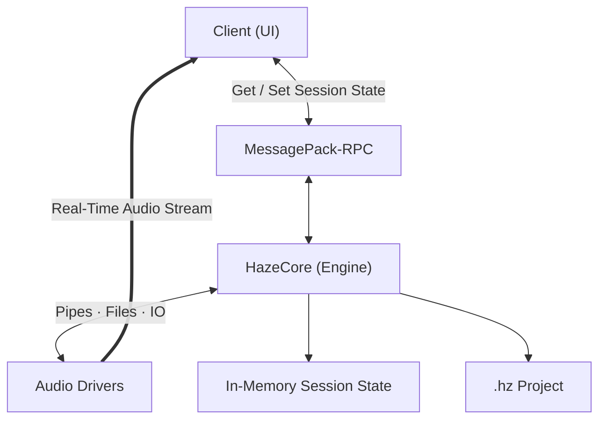

# Haze - A new concept for DAWs.

Haze is a DAW (Digital Audio Workstation) focused on extreme cross-platform flexibility—and it is completely free!

## Archtecture

Haze was designed to work with a "kernel-based" architecture, where the kernel manages audio, state, and generated files completely independently.

The way to connect to the Haze kernel is by creating a MsgPack-RPC client.

